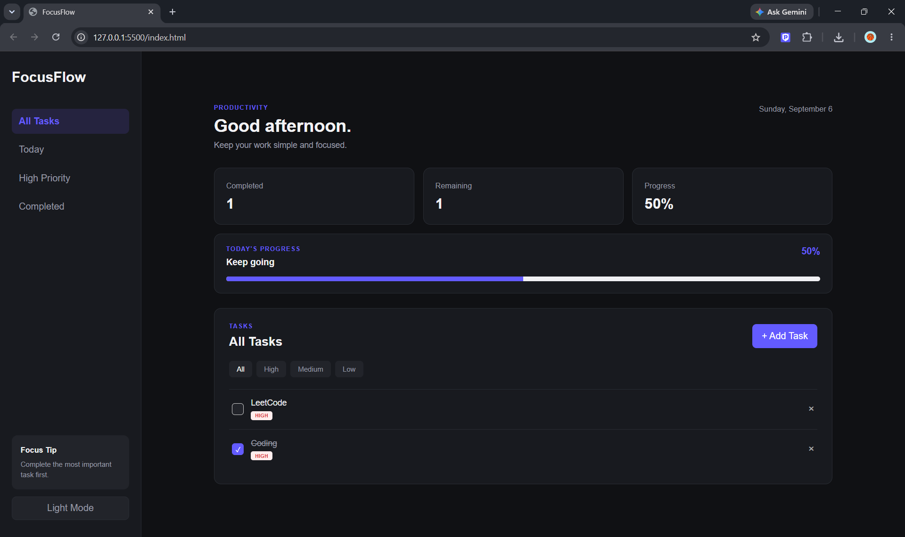

# FocusFlow

FocusFlow is a simple productivity dashboard built using HTML, CSS and JavaScript.

The project helps users manage daily tasks, set priorities and track their progress. Tasks are saved in the browser using LocalStorage, so they remain available even after refreshing the page.

## Preview

### Dashboard



## Features

* Add and delete tasks
* Mark tasks as completed
* Set task priority
* Filter tasks by priority
* View completed and high-priority tasks
* Track overall progress
* Dark mode
* Responsive design
* LocalStorage support

## Tech Stack

* HTML5
* CSS3
* JavaScript
* LocalStorage

## Project Structure

```text
FocusFlow/
├── index.html
├── style.css
└── script.js
```

## How to Run

1. Clone the repository.

```bash
git clone https://github.com/your-username/focusflow.git
```

2. Open the project folder.

3. Open `index.html` in your browser.

No additional installation or dependencies are required.

## What I Learned

While building this project, I practiced:

* Working with the DOM
* Handling JavaScript events
* Managing application state
* Using LocalStorage
* Creating dynamic HTML elements
* Filtering data
* Building responsive layouts
* Creating a simple dark mode

## Future Improvements

Some features I may add later:

* Edit existing tasks
* Task deadlines
* Search functionality
* Drag and drop tasks
* Backend API
* User authentication
* Database support

## Author

**Aasil**

Computer Science Student
GitHub: [AASIL005](https://github.com/AASIL005)

## License

This project is open for learning and personal use.
